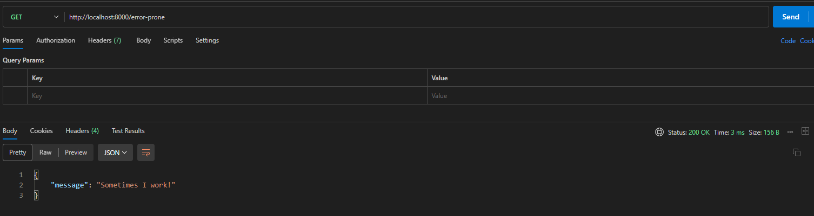
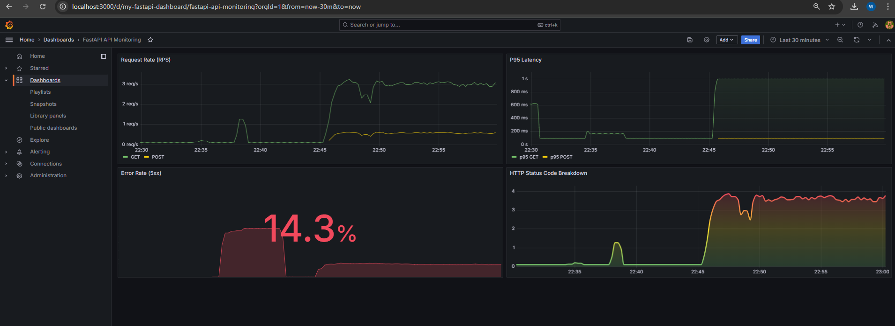

# FastAPI Monitoring Quickstart (Prometheus & Grafana)

A Dockerized setup to quickly monitor a FastAPI application using Prometheus and Grafana.

Fast Api call on postman:


Grafana Dashboard with few visualizations



## Overview

This project provides:
*   A simple FastAPI application instrumented for Prometheus.
*   A Prometheus instance to scrape metrics.
*   A Grafana instance with a pre-configured dashboard to visualize API metrics like request rate, latency, and errors.

## Prerequisites

*   [Docker](https://www.docker.com/get-started)
*   [Docker Compose](https://docs.docker.com/compose/install/)

## Getting Started

1.  **Clone the repository (if applicable) or ensure you have all project files.**
    ```bash
    # git clone git@github.com:Jafri115/fastapi-monitoring-grafana.git
    # cd fastapi-monitoring-demo
    ```

2.  **Build and run all services:**
    ```bash
    docker-compose up --build -d
    ```

3.  **Access the services:**
    *   **FastAPI App (/docs):** `http://localhost:8000/docs`
    *   **FastAPI Metrics:** `http://localhost:8000/metrics`
    *   **Prometheus UI:** `http://localhost:9090`
    *   **Grafana UI:** `http://localhost:3000` (Login: `admin`/`admin`)
        *   The "FastAPI API Monitoring" dashboard will be pre-loaded.

4.  **Generate Traffic (to see data in Grafana):**
    Open a new terminal and run the sample traffic script or use `curl` to hit the API endpoints (e.g., `http://localhost:8000/`, `http://localhost:8000/items/1`).
    ```bash
    # Example (run in a separate terminal):
    while true; do curl -s -o /dev/null http://localhost:8000/; sleep 0.2; done
    ```

5.  **View the Dashboard:**
    After generating some traffic, check the "FastAPI API Monitoring" dashboard in Grafana.

## Stopping Services

*   **Stop containers:**
    ```bash
    docker-compose down
    ```
*   **Stop containers and remove volumes (including Grafana data):**
    ```bash
    docker-compose down -v
    ```

---